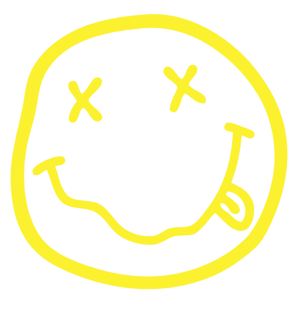
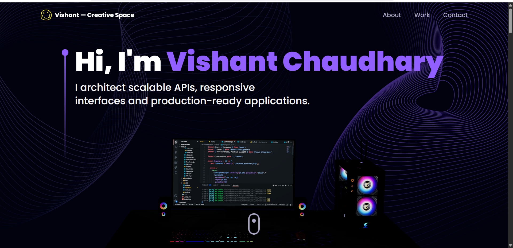

<div align="center">



# Vishant — Creative Space

### My corner of the internet. Built with code, powered by creativity.

<br/>

[](https://reactjs18-3-d-portfolio.vercel.app/)
[](https://opensource.org/license/mit/)

<br/>



</div>

---

## 📋 Table of Contents

- [Overview](#-overview)
- [Features](#-features)
- [Tech Stack](#-tech-stack)
- [Project Structure](#-project-structure)
- [Getting Started](#-getting-started)
- [Deployment](#-deployment)
- [Acknowledgements](#-acknowledgements)
- [Contact](#-contact)
- [License](#-license)

---

## 🧭 Overview

**Vishant — Creative Space** is a fully responsive, production-ready 3D portfolio that blends immersive WebGL visuals with smooth, scroll-driven animations. Every section is designed to feel alive — from the interactive desktop scene on load, to the rotating Earth in the contact section.

Built from scratch using **React 18**, **Three.js**, **Framer Motion**, and **Tailwind CSS** — this isn't a template. It's a statement.

---

## ✨ Features

- 🎮 **Interactive 3D Models** — Animated desktop PC and rotating Earth rendered in WebGL
- 🌌 **Dynamic Star Field** — Generative canvas-based animated background
- 🎞️ **Scroll-Driven Animations** — Every section reveals with Framer Motion transitions
- 📬 **Working Contact Form** — Sends real emails via EmailJS — zero backend needed
- 🧩 **Fully Modular** — Clean, typed component architecture; easy to extend
- 📱 **Pixel-Perfect Responsive** — Looks great on every screen size
- ⚡ **Instant Dev Experience** — Vite HMR makes iteration fast
- 🔐 **Strictly Typed** — End-to-end TypeScript, no `any` shortcuts

---

## 🛠 Tech Stack

| Category | Technology |
|---|---|
| **Frontend Framework** | React 18 |
| **Language** | TypeScript |
| **3D Rendering** | Three.js + @react-three/fiber |
| **Animations** | Framer Motion |
| **Styling** | Tailwind CSS |
| **Build Tool** | Vite |
| **Email Service** | EmailJS |
| **Linting** | ESLint + Prettier |
| **Deployment** | Vercel |

---

## 📁 Project Structure

```
vishant-creative-space/
├── public/
│   ├── desktop_pc/             # 3D PC model (GLTF + textures)
│   └── planet/                 # 3D Earth model (GLTF + textures)
│
├── src/
│   ├── App.tsx                 # Root component
│   ├── main.tsx                # Entry point
│   ├── globals.css
│   │
│   ├── assets/                 # Images, icons, company & tech logos
│   │
│   ├── components/
│   │   ├── atoms/              # Small reusable UI pieces
│   │   ├── canvas/             # All Three.js / WebGL components
│   │   │   ├── Ball.tsx
│   │   │   ├── Computers.tsx
│   │   │   ├── Earth.tsx
│   │   │   └── Stars.tsx
│   │   ├── layout/             # Navbar, Loader
│   │   └── sections/           # Hero, About, Experience, Works, Contact…
│   │
│   ├── constants/              # Site config, style tokens, data
│   ├── hoc/                    # SectionWrapper HOC
│   ├── utils/                  # Framer Motion animation variants
│   └── types/                  # Global TypeScript definitions
│
└── .env                        # EmailJS credentials (git-ignored)
```

---

## 🚀 Getting Started

**Requirements:** Node.js `>= 16`, npm `>= 8`, Git

```bash
# 1. Clone the repo
git clone https://github.com/ladunjexa/reactjs18-3d-portfolio.git
cd reactjs18-3d-portfolio

# 2. Install dependencies
npm install

# 3. Add your EmailJS credentials
cp .env.example .env
# Then fill in: VITE_EMAILJS_SERVICE_ID, VITE_EMAILJS_TEMPLATE_ID, VITE_EMAIL_JS_ACCESS_TOKEN

# 4. Run the dev server
npm run dev
```

| Script | What it does |
|---|---|
| `npm run dev` | Start dev server with HMR |
| `npm run build` | Production build → `./dist/` |
| `npm run preview` | Preview production build locally |
| `npm run lint` | Lint with ESLint |
| `npm run ts:check` | TypeScript type check |

---

## ☁️ Deployment

One-click deploy to your preferred platform:

[](https://vercel.com/new/clone?repository-url=https%3A%2F%2Fgithub.com%2Fladunjexa%2Freactjs18-3d-portfolio)
&nbsp;&nbsp;
[](https://app.netlify.com/start/deploy?repository=https://github.com/ladunjexa/reactjs18-3d-portfolio)

> Remember to set your `VITE_EMAILJS_*` environment variables in your platform's dashboard.

---

## 💎 Acknowledgements

| Tool | Role |
|---|---|
| **Three.js** + **React Three Fiber** | 3D rendering & WebGL |
| **Framer Motion** | Animations & transitions |
| **Tailwind CSS** | Utility-first styling |
| **React Vertical Timeline** | Experience section UI |
| **React Parallax Tilt** | Card tilt effect |
| **EmailJS** | Contact form delivery |
| **JavaScript Mastery** | Original project inspiration |

---

## 📬 Contact

<div align="center">

**Got a project in mind? Let's build something great.**

<br/>

[](https://www.linkedin.com/in/lironabutbul)
[](mailto:your@gmail.com)

</div>

---

## 📄 License

MIT — free to use, modify, and build upon.  
See [LICENSE](https://github.com/ladunjexa/reactjs18-3d-portfolio/blob/main/LICENSE) for full details.

---

<div align="center">

Crafted with ❤️ by **Vishant Chaudhary**

*If this helped you, a ⭐ means the world.*

</div>